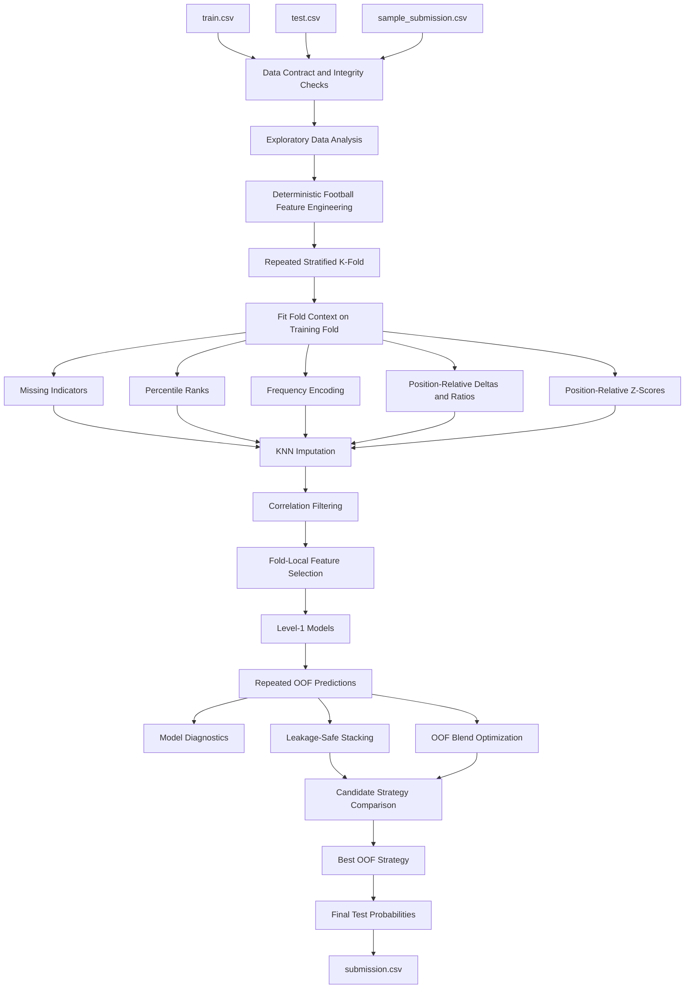
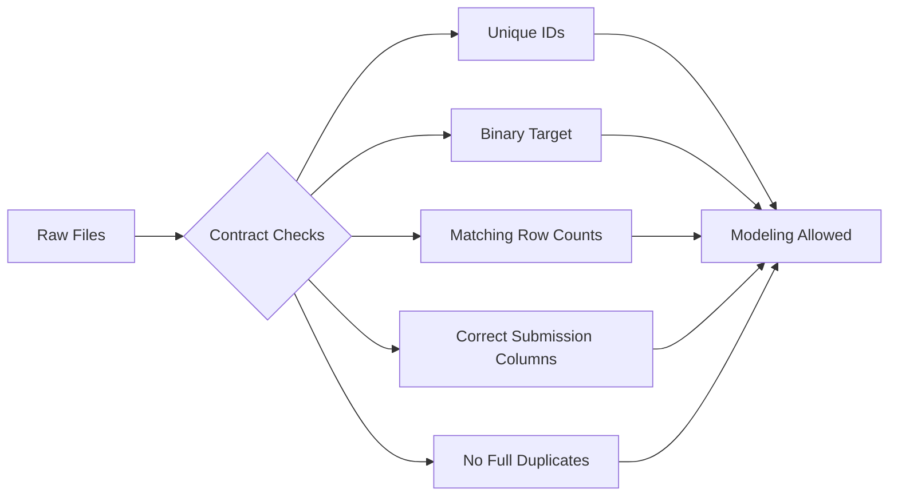
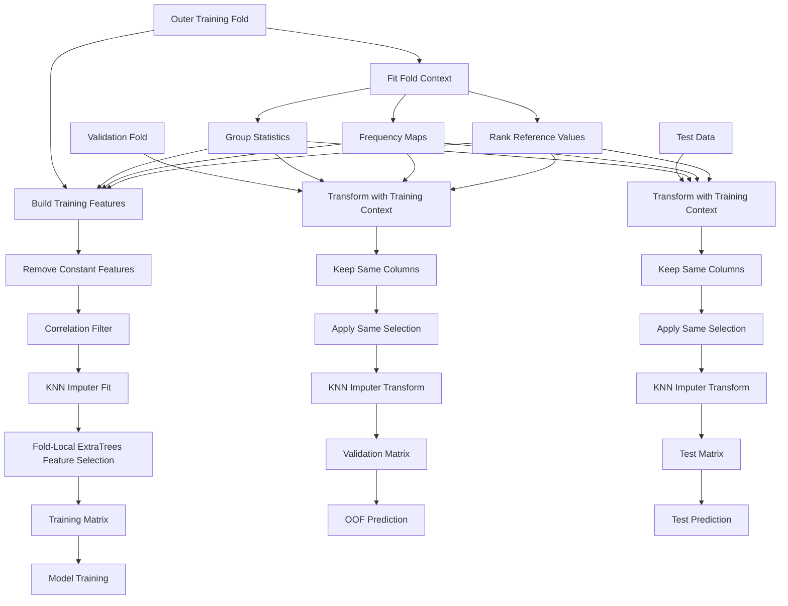
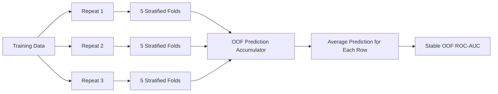
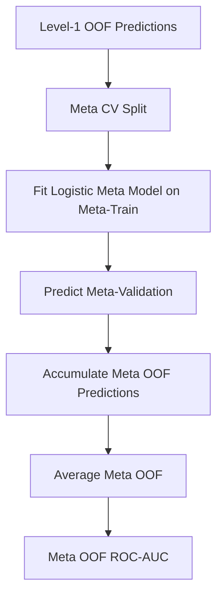
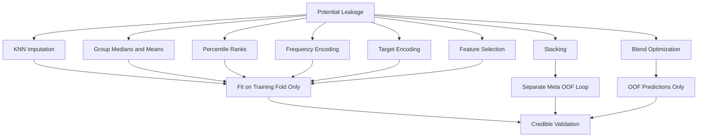

# NFL Draft Prediction — Leakage-Safe Machine Learning Ensemble

A complete machine learning workflow for ranking football prospects by their probability of being drafted.

The project focuses on reliable out-of-fold validation, football-aware feature engineering, leakage-safe preprocessing, model diversity, optimized ensemble selection, calibration diagnostics, train-test drift analysis, and a clean probability-based submission pipeline.

The final solution reaches an out-of-fold ROC-AUC of **0.874653** and selects **NoLightGBMOptimizedBlend** as the best validated ranking strategy.

## Table of Contents

- [Executive Summary](#executive-summary)
- [Problem Definition](#problem-definition)
- [Project Objectives](#project-objectives)
- [Solution Architecture](#solution-architecture)
- [Dataset Overview](#dataset-overview)
- [Data Dictionary](#data-dictionary)
- [Data Integrity Checks](#data-integrity-checks)
- [Exploratory Data Analysis](#exploratory-data-analysis)
- [Feature Engineering](#feature-engineering)
- [Leakage-Safe Preprocessing](#leakage-safe-preprocessing)
- [Cross-Validation Strategy](#cross-validation-strategy)
- [Level-1 Models](#level-1-models)
- [Base Model Results](#base-model-results)
- [Classification Diagnostics](#classification-diagnostics)
- [Leakage-Safe Stacking](#leakage-safe-stacking)
- [OOF Blend Optimization](#oof-blend-optimization)
- [Final Model Selection](#final-model-selection)
- [Ablation Study](#ablation-study)
- [Feature Selection Study](#feature-selection-study)
- [Feature Importance and Explainability](#feature-importance-and-explainability)
- [Train-Test Drift Analysis](#train-test-drift-analysis)
- [Calibration Diagnostics](#calibration-diagnostics)
- [Error Analysis](#error-analysis)
- [Final Submission](#final-submission)
- [Validation Safety](#validation-safety)
- [Runtime and Reproducibility](#runtime-and-reproducibility)
- [Repository Structure](#repository-structure)
- [Installation](#installation)
- [How to Run](#how-to-run)
- [Dependencies](#dependencies)
- [Limitations](#limitations)
- [Future Improvements](#future-improvements)
- [Key Takeaways](#key-takeaways)

## Executive Summary

This project treats draft prediction as a **binary ranking problem**.

Each player receives a probability score representing the likelihood of being drafted. The primary evaluation metric is ROC-AUC because the goal is to rank drafted players above non-drafted players rather than force every prediction into a fixed binary threshold.

The notebook builds the full workflow from raw validation to final submission.

Key design principles include:

1. Every fitted transformation is learned inside the training fold only.
2. Repeated out-of-fold predictions are averaged rather than overwritten.
3. Feature engineering uses football context instead of player identifiers.
4. Model selection is based on OOF evidence only.
5. Stacking uses a separate OOF meta-model loop.
6. Blend weights are optimized on OOF predictions only.
7. ROC-AUC is the primary model-selection metric.
8. Accuracy, precision, recall, F1, calibration, drift, and errors are used as supporting diagnostics.
9. The final output is a single probability-based `submission.csv` file.

### Final results

| Metric | Result |
|---|---:|
| Training rows | 2,781 |
| Test rows | 696 |
| Positive target rate | 56.02% |
| Base models | 5 |
| Validation design | 5 folds x 3 repeats |
| Total level-1 validation folds | 15 |
| Best individual OOF ROC-AUC | 0.872585 |
| Best individual model | XGBoost |
| Meta-model OOF ROC-AUC | 0.872912 |
| Best final strategy | NoLightGBMOptimizedBlend |
| Final OOF ROC-AUC | **0.874653** |
| Submission rows | 696 |
| Submission columns | 2 |
| Notebook runtime | Approximately 558 seconds |

The final ensemble improves on the strongest single model while preserving a fully leakage-safe validation design.

## Problem Definition

The task is to estimate the probability that a football prospect will be drafted.

The target variable is:

```text
Drafted = 1  -> Player was drafted
Drafted = 0  -> Player was not drafted
```

The model uses player measurements and football context such as:

- Age
- Height
- Weight
- 40-yard sprint time
- Vertical jump
- Bench press repetitions
- Broad jump
- Three-cone agility
- Shuttle time
- School
- Player type
- Position type
- Position

The player `Id` is never used as a predictive feature. It is retained only for submission alignment.

The output is a continuous probability between 0 and 1.

```text
Id,Drafted
2781,0.666602
2782,0.760884
2783,0.933373
...
```

## Project Objectives

The workflow is designed to:

1. Load and validate the training, test, and sample-submission files.
2. Confirm ID uniqueness, target validity, row counts, and submission structure.
3. Explore class balance, missing values, football positions, and athletic measurements.
4. Build football-aware engineered features.
5. Create fold-safe ranks, frequency encodings, group statistics, deltas, ratios, and z-scores.
6. Prevent leakage from imputation, encoding, feature selection, and group statistics.
7. Compare multiple model families.
8. Use repeated stratified cross-validation for stable OOF estimates.
9. Evaluate individual models and ensemble diversity.
10. Build a leakage-safe stacking model.
11. Optimize probability and rank blends using OOF predictions only.
12. Run an ablation study to measure feature-family contribution.
13. Audit train-test drift.
14. Evaluate probability calibration.
15. Inspect high-confidence errors.
16. Create a submission file that exactly matches the required contract.

## Solution Architecture



## Dataset Overview

The provided dataset is compact and structured.

| Dataset | Rows | Columns | Target Included |
|---|---:|---:|---|
| `train.csv` | 2,781 | 16 | Yes |
| `test.csv` | 696 | 15 | No |
| `sample_submission.csv` | 696 | 2 | Submission contract |

### Target distribution

| Target | Count | Share |
|---|---:|---:|
| Drafted | 1,558 | 56.02% |
| Not drafted | 1,223 | 43.98% |

The target is not severely imbalanced, but the workflow still uses stratification and balanced class weights where appropriate.

### Football coverage

| Category | Training Set |
|---|---:|
| Years | 2009–2019 |
| Schools | 246 |
| Player types | 3 |
| Position types | 7 |
| Positions | 20 |

Player types include:

```text
offense
defense
special_teams
```

Position types include:

```text
backs_receivers
defensive_back
defensive_lineman
kicking_specialist
line_backer
offensive_lineman
other_special
```

## Data Dictionary

| Column | Type | Role | Description |
|---|---|---|---|
| `Id` | Integer | Identifier | Unique player identifier used for submission alignment only |
| `Year` | Integer | Numeric feature | Observation or draft year |
| `Age` | Float | Numeric feature | Player age |
| `School` | Categorical | Context feature | College or school |
| `Height` | Float | Numeric feature | Height in meters |
| `Weight` | Float | Numeric feature | Weight in kilograms |
| `Sprint_40yd` | Float | Workout feature | 40-yard sprint time |
| `Vertical_Jump` | Float | Workout feature | Vertical jump measurement |
| `Bench_Press_Reps` | Float | Workout feature | Bench press repetitions |
| `Broad_Jump` | Float | Workout feature | Broad jump measurement |
| `Agility_3cone` | Float | Workout feature | Three-cone agility time |
| `Shuttle` | Float | Workout feature | Shuttle time |
| `Player_Type` | Categorical | Context feature | Offense, defense, or special teams |
| `Position_Type` | Categorical | Context feature | Broader football role group |
| `Position` | Categorical | Context feature | Specific football position |
| `Drafted` | Binary | Target | Whether the player was drafted |

### Missing values in training data

The largest missing-value counts are concentrated in workout and age fields.

| Feature | Missing Rows |
|---|---:|
| `Agility_3cone` | 1,024 |
| `Shuttle` | 952 |
| `Bench_Press_Reps` | 759 |
| `Broad_Jump` | 595 |
| `Vertical_Jump` | 578 |
| `Age` | 543 |
| `Sprint_40yd` | 172 |

Missingness is treated as potentially informative. A missing workout can reflect player role, workout participation, or data availability rather than pure random noise.

## Data Integrity Checks

The notebook validates the project contract before model training.

The checks confirm that:

- The target exists in training data.
- The ID column exists in train and test.
- The sample submission contains the correct ID and target columns.
- Training IDs are unique.
- Test IDs are unique.
- The sample-submission row count matches test rows.
- The training target is binary.
- No fully duplicated training rows exist.

All implemented integrity checks pass in the executed notebook.



## Exploratory Data Analysis

The notebook contains a visual EDA layer designed to support modeling decisions rather than produce charts without purpose.

### Dataset and target balance

The training set contains 2,781 players with a 56.02% drafted rate.

This supports stratified validation while avoiding aggressive class-imbalance techniques.

### Missingness analysis

The notebook examines:

- Missing values by feature
- Missing values per player
- Workout completion
- Train-test missingness differences

This leads directly to missing indicators and KNN imputation inside each training fold.

### Numeric distribution alignment

Train and test distributions are compared for core numeric variables.

The objective is to detect large shifts before fitting complex models.

### Position coverage

The notebook studies `Position`, `Position_Type`, and `Player_Type` because raw athletic measurements have different meaning across roles.

A 4.5-second sprint can mean something different for a wide receiver and an offensive lineman. The model therefore creates role-relative features instead of relying only on raw values.

### Athletic profile analysis

The EDA includes:

- Athletic profile maps
- Numeric correlation maps
- Distribution grids
- Target-conditioned radar charts
- Draft-rate analysis by football context
- Rank-bucket signal checks

The main modeling conclusion is that no single raw measurement is sufficient. The strongest workflow combines raw measurements, engineered ratios, missingness, and position-relative transformations.

## Feature Engineering

The project creates deterministic row-level features before fold-specific statistical transformations.

### Core engineered features

| Feature | Formula or Meaning |
|---|---|
| `BMI` | `Weight / Height²` |
| `Height_Weight_Ratio` | `Height / Weight` |
| `Speed_Index` | `1 / Sprint_40yd` |
| `Agility_Index` | `1 / (Agility_3cone + Shuttle)` |
| `Explosiveness_Index` | Mean of vertical and broad jump |
| `Power_Mass_Index` | `(Vertical + Broad + Bench) / Weight` |
| `Speed_Weight_Index` | `Weight / Sprint_40yd` |
| `Size_Index` | `Height * Weight` |
| `Burst_Score` | `(Vertical + Broad) / Sprint_40yd` |
| `Strength_Mass_Ratio` | `Bench_Press_Reps / Weight` |
| `Size_Speed_Balance` | `(Height * Weight) / Sprint_40yd` |
| `Explosive_Mass_Balance` | `(Vertical * Broad) / Weight` |
| `Agility_Load_Index` | `Weight * (Agility_3cone + Shuttle)` |
| `Age_Adjusted_Speed` | `Speed_Index / Age` |
| `Age_Adjusted_Power` | `Power_Mass_Index / Age` |
| `Age_Adjusted_Burst` | `Burst_Score / Age` |
| `Jump_Efficiency` | `Vertical_Jump / Broad_Jump` |
| `Lower_Body_Power` | `Vertical_Jump * Broad_Jump` |
| `Upper_Lower_Balance` | `Bench_Press_Reps / Explosiveness_Index` |
| `Workout_Completion_Rate` | Share of available workout measurements |
| `Missing_Count` | Number of missing raw numeric features |

The pipeline also creates one missing indicator for every raw numeric variable.

### Why football-context features matter

Raw combine measurements are not directly comparable across every position.

The workflow therefore creates position-relative representations for numeric and engineered variables.

For each grouping level:

```text
Position
Position_Type
Player_Type
```

The pipeline can create:

```text
Delta = Player Value - Group Median

Ratio = Player Value / Group Median

Z-Score = (Player Value - Group Mean) / Group Standard Deviation
```

This lets the model answer questions such as:

```text
How fast is this player relative to others at the same position?

How explosive is this player relative to the expected profile for the role?
```

### Percentile ranks

Numeric features also receive training-fold percentile ranks.

Ranks make the system more robust to scale differences and outliers.

### Frequency encoding

Categorical variables are encoded using fold-specific frequency maps.

```text
School_Frequency
Player_Type_Frequency
Position_Type_Frequency
Position_Frequency
```

This preserves category prevalence without creating a large one-hot matrix.

### Optional target encoding

The notebook implements OOF-safe target encoding for:

```text
School
Position
Position_Type
```

However, target encoding is disabled in the final configuration because the final model-selection process did not require it.

The ablation study still evaluates its incremental effect.

## Leakage-Safe Preprocessing

Leakage prevention is the central technical design of this project.

Any transformation that learns statistics from the data is fitted inside the training part of each validation fold only.

This applies to:

- Group medians
- Group means
- Group standard deviations
- Percentile-rank reference distributions
- Frequency maps
- OOF target encoding
- KNN imputation
- Correlation filtering
- Feature selection

### Fold-safe transformation flow



### KNN imputation

The final configuration uses:

```text
KNNImputer
neighbors = 7
weights = distance
```

The imputer is fitted only on the current training fold.

### Correlation filtering

Highly correlated duplicate features are removed using an absolute-correlation threshold of:

```text
0.985
```

The decision is learned from the current training fold only.

### Fold-local feature selection

An `ExtraTreesClassifier` is used as the feature selector.

The final main pipeline keeps up to:

```text
120 features per fold
```

The selector is never fitted on validation rows.

## Cross-Validation Strategy

The project uses repeated stratified cross-validation.

```text
Number of folds: 5
Number of repeats: 3
Total level-1 splits: 15
Random seed: 42
```

Each player receives multiple validation predictions across repeats.

The correct OOF value is the average of every validation prediction received by that row.



This avoids a common repeated-CV mistake where a later fold overwrites an earlier prediction.

## Level-1 Models

The workflow combines models with different inductive biases.

| Model | Main Role |
|---|---|
| LightGBM | Gradient-boosted decision trees |
| XGBoost | Regularized gradient boosting |
| Random Forest | Bagged tree ensemble |
| Extra Trees | Highly randomized tree ensemble |
| Robust Logistic | Linear standardized baseline and ensemble diversifier |

### LightGBM configuration

```text
n_estimators = 950
learning_rate = 0.018
num_leaves = 18
max_depth = 4
subsample = 0.82
colsample_bytree = 0.72
reg_alpha = 0.35
reg_lambda = 2.4
min_child_samples = 34
objective = binary
```

### XGBoost configuration

```text
n_estimators = 850
learning_rate = 0.018
max_depth = 3
subsample = 0.88
colsample_bytree = 0.76
reg_alpha = 0.18
reg_lambda = 2.2
min_child_weight = 2.5
gamma = 0.03
objective = binary:logistic
```

### Random Forest configuration

```text
n_estimators = 750
max_depth = 9
min_samples_leaf = 7
max_features = sqrt
class_weight = balanced_subsample
```

### Extra Trees configuration

```text
n_estimators = 900
max_depth = 9
min_samples_leaf = 5
max_features = sqrt
class_weight = balanced
```

### Robust Logistic configuration

```text
StandardScaler
LogisticRegression
C = 0.55
penalty = l2
solver = liblinear
class_weight = balanced
max_iter = 6000
```

HistGradientBoosting is intentionally excluded from the final model set because prior diagnostics in the notebook indicated near-random ranking behavior.

## Base Model Results

### OOF ROC-AUC

| Rank | Model | OOF ROC-AUC |
|---:|---|---:|
| 1 | XGBoost | **0.872585** |
| 2 | LightGBM | 0.869989 |
| 3 | Random Forest | 0.867803 |
| 4 | Robust Logistic | 0.865416 |
| 5 | Extra Trees | 0.861139 |

XGBoost is the strongest individual model by OOF ROC-AUC.

### Fold stability

| Model | Mean Fold ROC-AUC | Std | Min | Max |
|---|---:|---:|---:|---:|
| XGBoost | 0.869346 | 0.014368 | 0.846036 | 0.890345 |
| Random Forest | 0.866710 | 0.015227 | 0.843803 | 0.889783 |
| LightGBM | 0.865160 | 0.016383 | 0.838745 | 0.887361 |
| Robust Logistic | 0.863593 | 0.013932 | 0.838336 | 0.888291 |
| Extra Trees | 0.860590 | 0.015257 | 0.831734 | 0.880285 |

The repeated-CV results show that performance is not driven by one lucky validation split.

## Classification Diagnostics

ROC-AUC is the primary ranking metric. Accuracy is used only as a supporting diagnostic.

The notebook searches thresholds between 0.05 and 0.95 inside each validation fold and records the best threshold-based accuracy for diagnostic purposes.

### Mean best-fold classification metrics

| Model | Mean Best Accuracy | Precision | Recall | F1 |
|---|---:|---:|---:|---:|
| XGBoost | **0.803424** | 0.782350 | 0.901150 | 0.836876 |
| LightGBM | 0.800906 | 0.778642 | 0.902651 | 0.835455 |
| Random Forest | 0.798871 | 0.787918 | 0.880393 | 0.830285 |
| Robust Logistic | 0.793116 | 0.762568 | 0.921710 | 0.833009 |
| Extra Trees | 0.792998 | 0.784208 | 0.874002 | 0.825419 |

These values are fold-level threshold diagnostics. They are not used to convert the final submission into binary classes.

The final submission remains continuous because ROC-AUC rewards ranking quality.

## Leakage-Safe Stacking

The project also trains a second-level logistic meta-model.

The meta-model does not evaluate itself on the same level-1 rows used to fit it.

Instead, it uses another repeated stratified OOF loop over the level-1 OOF prediction matrix.



Meta-model result:

```text
OOF ROC-AUC = 0.872912
```

The stacking model is competitive but does not beat the best optimized blend.

## OOF Blend Optimization

The notebook compares multiple ensemble strategies.

The candidate set includes:

- Individual models
- Mean probability blend
- Mean rank blend
- Optimized probability blend
- Optimized rank blend
- No-LightGBM optimized blend
- Robust/XGBoost/tree optimized blend
- Probability-rank hybrid blend
- Leakage-safe OOF meta model

Blend weights are searched using random Dirichlet draws and evaluated only against OOF predictions.

```text
Random weight search iterations = 6,500 per optimized candidate
```

### Candidate results

| Rank | Candidate | OOF ROC-AUC |
|---:|---|---:|
| 1 | **NoLightGBMOptimizedBlend** | **0.874653** |
| 2 | OptimizedProbabilityBlend | 0.874586 |
| 3 | ProbabilityRankHybridBlend | 0.874547 |
| 4 | RobustXGBTreeOptimizedBlend | 0.874429 |
| 5 | OptimizedRankBlend | 0.874398 |
| 6 | MeanProbabilityBlend | 0.873604 |
| 7 | OOFMetaModel | 0.872912 |
| 8 | MeanRankBlend | 0.872818 |
| 9 | XGBoost | 0.872585 |
| 10 | LightGBM | 0.869989 |
| 11 | RandomForest | 0.867803 |
| 12 | RobustLogistic | 0.865416 |
| 13 | ExtraTrees | 0.861139 |

### Diagnostic optimized probability weights

For the full five-model optimized probability blend, the notebook finds approximately:

| Model | Weight |
|---|---:|
| LightGBM | 0.048818 |
| XGBoost | 0.484984 |
| Random Forest | 0.196952 |
| Extra Trees | 0.007950 |
| Robust Logistic | 0.261296 |

These weights describe the five-model `OptimizedProbabilityBlend`, not the final `NoLightGBMOptimizedBlend`.

The final strategy is selected because it produces the highest OOF ROC-AUC among all tested candidates.

## Final Model Selection

The final selected strategy is:

```text
NoLightGBMOptimizedBlend
```

Final OOF result:

```text
ROC-AUC = 0.874653
```

The final blend excludes LightGBM because the OOF optimization found a slightly stronger ranking combination without it.

This does not mean LightGBM is a weak model. LightGBM remains the second-best individual model and contributes useful diagnostics. The final decision is based only on the observed OOF ranking score.

### Improvement over the strongest individual model

```text
Best individual model: XGBoost
XGBoost OOF ROC-AUC: 0.872585
Final ensemble OOF ROC-AUC: 0.874653
Absolute improvement: 0.002068
```

The improvement is small but consistent with the objective of maximizing ranking quality without weakening validation discipline.

## Ablation Study

The ablation study measures how feature families contribute to ROC-AUC.

Each stage keeps preprocessing inside the validation folds.

| Stage | OOF ROC-AUC |
|---|---:|
| Base numeric features only | 0.860588 |
| + Missing indicators | 0.861167 |
| + Ranks and frequency | 0.861858 |
| + Position deltas | 0.865466 |
| + Position z-scores | 0.865241 |
| + OOF target encoding | 0.866279 |
| Best level-1 model | 0.872585 |
| Best final strategy | **0.874653** |

The largest feature-engineering improvement occurs when position-relative information is added.

This supports the football-specific design choice of comparing players with relevant role groups rather than using raw combine values alone.

## Feature Selection Study

The notebook compares several fold-local feature-count limits.

| Feature Set | OOF ROC-AUC |
|---|---:|
| Top 80 | **0.865241** |
| All filtered features | 0.864425 |
| Top 50 | 0.863812 |
| Top 120 | 0.863731 |

The main repeated ensemble configuration uses up to 120 features per fold.

The separate quick feature-count study shows that smaller feature sets can perform similarly or slightly better for a single-model diagnostic run. This supports continued feature-selection tuning rather than assuming more features always improve the model.

## Feature Importance and Explainability

The notebook uses several complementary explainability methods.

### Aggregated tree importance

Importance is aggregated from tree models trained on fold-specific training data.

Top recurring signals include:

| Feature | Aggregated Importance |
|---|---:|
| `Age_Missing` | 0.103788 |
| `Age_Missing_Position_Z` | 0.078820 |
| `Age_Missing_Position_Delta` | 0.059678 |
| `Age_Adjusted_Burst_Missing` | 0.045070 |
| `Year` | 0.033125 |
| `Age_Missing_Position_Ratio` | 0.028876 |
| `Year_Position_Z` | 0.024200 |
| `Year_Position_Delta` | 0.020401 |
| `Sprint_40yd_Position_Z` | 0.016869 |
| `Year_Position_Type_Delta` | 0.016344 |

The prominence of missingness variables suggests that whether a measurement is available can carry predictive signal.

### Permutation importance

Permutation importance is calculated on a clean holdout fold after fitting preprocessing and the model only on the holdout-training partition.

Top signals include:

| Feature | Mean ROC-AUC Drop |
|---|---:|
| `Age_Missing_Position_Z` | 0.047370 |
| `Age_Missing` | 0.032529 |
| `Year` | 0.028316 |
| `Year_Position_Z` | 0.008153 |
| `Sprint_40yd_Position_Z` | 0.005449 |
| `Age_Position_Z` | 0.004010 |
| `Sprint_40yd_Position_Type_Delta` | 0.003882 |
| `Sprint_40yd_Position_Delta` | 0.002471 |
| `Year_Position_Delta` | 0.002289 |
| `Explosiveness_Index_Position_Z` | 0.002075 |

This again supports the role-relative feature design.

### SHAP

The notebook includes optional SHAP support for tree-model explanation.

In the recorded execution, SHAP plotting was skipped because a compatible setup was not available.

## Train-Test Drift Analysis

The notebook evaluates numeric drift with:

- Kolmogorov-Smirnov statistic
- Population Stability Index

### Numeric drift summary

| Feature | KS Statistic | PSI |
|---|---:|---:|
| `Year` | 0.140925 | 0.108356 |
| `Broad_Jump` | 0.048620 | 0.026418 |
| `Vertical_Jump` | 0.018033 | 0.025446 |
| `Bench_Press_Reps` | 0.051560 | 0.018676 |
| `Agility_3cone` | 0.041116 | 0.014631 |
| `Shuttle` | 0.036977 | 0.014303 |
| `Sprint_40yd` | 0.023393 | 0.009930 |
| `Height` | 0.021113 | 0.008485 |
| `Weight` | 0.033086 | 0.007257 |
| `Age` | 0.029068 | 0.004956 |

`Year` shows the strongest distribution difference among the inspected numeric variables.

The workflow reduces sensitivity to raw distribution shifts through ranks, role-relative statistics, and ensemble diversity.

### Categorical drift and unseen categories

| Feature | Train Unique | Test Unique | Overlap | Unseen Test Categories | Rare Train Categories |
|---|---:|---:|---:|---:|---:|
| `School` | 246 | 147 | 146 | 1 | 175 |
| `Player_Type` | 3 | 3 | 3 | 0 | 0 |
| `Position_Type` | 7 | 6 | 6 | 0 | 1 |
| `Position` | 20 | 18 | 18 | 0 | 2 |

Frequency encoding handles unseen categories by mapping them to zero frequency rather than failing at inference time.

## Calibration Diagnostics

ROC-AUC measures ranking quality. Calibration measures whether predicted probabilities correspond to observed frequencies.

The final OOF predictions produce:

| Metric | Value |
|---|---:|
| Brier Score | 0.137103 |
| Log Loss | 0.417370 |
| Calibration Slope | 1.103889 |
| Calibration Intercept | 0.036135 |

The model is strongest as a ranking system.

The calibration slope above 1 and the observed bin gaps indicate that exact probability interpretation should be treated separately from ranking performance if the model is later used for decision thresholds or forecasting.

## Error Analysis

The notebook creates an OOF threshold based on the observed positive rate and inspects ranking disagreements.

| Error Type | Count |
|---|---:|
| Correct | 2,187 |
| High-Confidence False Negative | 297 |
| High-Confidence False Positive | 297 |

The error analysis then inspects individual cases by:

- Year
- School
- Position
- Position type
- OOF probability
- True drafted label

This makes it possible to identify prospect profiles that the current feature set does not represent well.

## Final Submission

The project creates one final file:

```text
submission.csv
```

The notebook validates that:

- Submission IDs match the sample-submission IDs.
- Column names match the sample submission exactly.
- Prediction values stay between 0 and 1.
- The score contains enough unique probability values for meaningful ranking.

Final submission shape:

```text
696 rows x 2 columns
```

Example:

```text
Id,Drafted
2781,0.666602
2782,0.760884
2783,0.933373
2784,0.602782
2785,0.856018
```

### Submission probability distribution

| Statistic | Drafted Probability |
|---|---:|
| Mean | 0.544841 |
| Standard deviation | 0.303926 |
| Minimum | 0.005212 |
| 25th percentile | 0.338362 |
| Median | 0.609640 |
| 75th percentile | 0.805754 |
| Maximum | 0.978384 |

The broad probability spread is useful for a ROC-AUC ranking task.

## Validation Safety

The project explicitly documents its validation policy.

| Design Area | Policy |
|---|---|
| Validation | 5 folds x 3 repeats with averaged OOF predictions |
| Preprocessing | Every fitted transformation is learned inside the training fold |
| Feature selection | Fold-local selection |
| Stacking | Separate OOF loop for the meta model |
| Blend weights | Optimized from OOF predictions only |
| Final submission | One probability file aligned to the sample submission |
| Metric priority | ROC-AUC first, accuracy second, calibration as a probability audit |

### Leakage sources explicitly controlled



## Runtime and Reproducibility

The executed notebook reports the following environment:

| Package | Version |
|---|---|
| Python | 3.10.20 |
| pandas | 2.2.2 |
| NumPy | 1.26.4 |
| scikit-learn | 1.4.2 |
| LightGBM | 4.6.0 |
| XGBoost | 3.2.0 |

Randomness is controlled with:

```python
SEED = 42
N_SPLITS = 5
N_REPEATS = 3
```

The recorded full notebook runtime is approximately:

```text
558 seconds
```

Runtime depends on CPU, package versions, and available parallel workers.

## Repository Structure

A clean GitHub repository structure is recommended.

```text
nfl-draft-prediction/
│
├── README.md
├── requirements.txt
├── .gitignore
│
├── data/
│   ├── train.csv
│   ├── test.csv
│   └── sample_submission.csv
│
├── notebooks/
│   └── nfl_draft_prediction.ipynb
│
├── outputs/
│   └── submission.csv
│
└── docs/
    └── project_figures/
```

For a small portfolio repository, a simpler layout is also acceptable:

```text
nfl-draft-prediction/
│
├── README.md
├── requirements.txt
├── train.csv
├── test.csv
├── sample_submission.csv
└── nfl_draft_prediction.ipynb
```

Avoid committing notebook checkpoint files, local virtual environments, cache folders, or temporary outputs.

## Installation

Clone the repository:

```bash
git clone https://github.com/<your-username>/nfl-draft-prediction.git
cd nfl-draft-prediction
```

Create a virtual environment:

```bash
python -m venv .venv
```

Activate it on Windows:

```bash
.venv\Scripts\activate
```

Activate it on Linux or macOS:

```bash
source .venv/bin/activate
```

Install dependencies:

```bash
pip install -r requirements.txt
```

Launch Jupyter:

```bash
jupyter notebook
```

Open:

```text
notebooks/nfl_draft_prediction.ipynb
```

If the files are stored in the repository root, the notebook's file-discovery logic can also detect common `train*.csv` and `test*.csv` patterns.

## How to Run

The expected execution order is already built into the notebook.

1. Place `train.csv`, `test.csv`, and `sample_submission.csv` in a location detected by the notebook.
2. Start Jupyter Notebook or JupyterLab.
3. Open `nfl_draft_prediction.ipynb`.
4. Run all cells from top to bottom.
5. Review the data-integrity checks.
6. Review EDA and feature-engineering diagnostics.
7. Train the repeated-CV level-1 models.
8. Run stacking and blend optimization.
9. Confirm the final decision box.
10. Run the final submission section.
11. Retrieve `submission.csv`.

The expected final strategy in the recorded run is:

```text
NoLightGBMOptimizedBlend
```

The expected validation score in the recorded run is:

```text
OOF ROC-AUC = 0.874653
```

Small differences can occur if package versions, data files, random-state handling, or numerical libraries differ.

## Dependencies

A practical `requirements.txt` can contain:

```text
numpy==1.26.4
pandas==2.2.2
scikit-learn==1.4.2
lightgbm==4.6.0
xgboost==3.2.0
matplotlib
scipy
jupyter
shap
```

`SHAP` is optional for the core training and submission pipeline.

## Limitations

This project has several limitations that should be considered before interpreting the predictions as a real scouting decision system.

### Dataset size

The training set contains only 2,781 players.

Complex models can overfit small tabular datasets, which is why the project places strong emphasis on repeated OOF validation and conservative feature selection.

### Historical context

The data covers 2009–2019.

Draft strategy, position valuation, combine practices, league rules, and scouting preferences can change over time.

### Missing data

Several workout features have substantial missingness.

Missingness can contain signal, but it can also represent non-random measurement availability.

### Limited football information

The available features focus on physical measurements and broad context.

The model does not include many variables that can affect real draft outcomes, such as:

- College production
- Game film grades
- Injuries
- Medical evaluations
- Character assessments
- Team scheme fit
- Positional need
- Draft capital projections
- Interviews
- Pro-day results not represented in the dataset

### Probability calibration

The model ranks players well, but the probabilities are not perfect estimates of real-world draft frequency.

Calibration should be revisited before using the scores as absolute probabilities.

### Validation versus external performance

The reported 0.874653 score is an internal out-of-fold ROC-AUC estimate.

It is not a guarantee of the same score on a hidden competition leaderboard, future draft class, or external dataset.

## Future Improvements

Potential next steps include:

1. Add time-aware validation to simulate prediction on future draft classes.
2. Compare GroupKFold or year-based holdout strategies.
3. Tune the final ensemble with nested cross-validation.
4. Add Bayesian hyperparameter optimization.
5. Test CatBoost for direct categorical handling.
6. Compare calibrated and uncalibrated ensemble outputs.
7. Add isotonic or Platt calibration using a clean calibration layer.
8. Improve target encoding with smoothing and regularization.
9. Evaluate interaction features only when they improve repeated OOF performance.
10. Add player production statistics if available.
11. Add college conference strength and school historical draft rate with strict time-safe encoding.
12. Build separate position-specific models where sample size allows.
13. Add temporal drift monitoring.
14. Add SHAP summary and local explanation reports in a compatible environment.
15. Package the pipeline into reusable training and inference modules.
16. Build a small Streamlit or Gradio interface for single-player scoring.
17. Add MLflow or another experiment-tracking system.
18. Add unit tests for data contracts and feature-generation functions.

## Key Takeaways

The strongest part of this project is not only the final ROC-AUC score.

The workflow is designed to make that score defensible.

The final system combines:

- Football-aware feature engineering
- Missingness modeling
- Position-relative comparisons
- Fold-safe imputation
- Fold-safe categorical statistics
- Fold-local feature selection
- Repeated stratified validation
- Averaged OOF predictions
- Diverse model families
- Leakage-safe stacking
- OOF-only blend optimization
- Ablation testing
- Drift diagnostics
- Calibration diagnostics
- Error analysis
- Submission-contract validation

The strongest individual model reaches:

```text
XGBoost OOF ROC-AUC = 0.872585
```

The selected ensemble reaches:

```text
NoLightGBMOptimizedBlend OOF ROC-AUC = 0.874653
```

The project demonstrates how careful validation, domain-aware feature engineering, and ensemble design can improve a compact tabular machine learning problem without relying on validation leakage.
